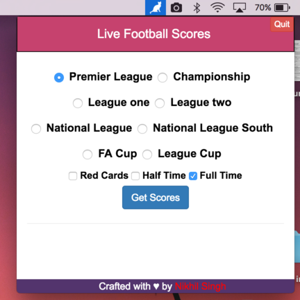
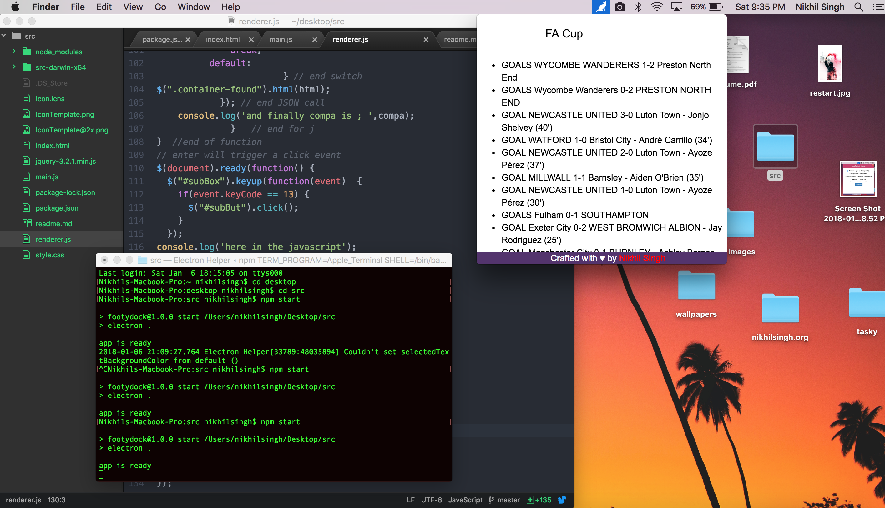

[](https://github.com/nikhilmufc7/Football-Dock/releases) [](#)   

# Football Dock : Live football scores app for your menu bar [Initial Beta Release]
### For Geeks who love football :soccer:
### Available for macOS:apple:, Linux:penguin: and Windows:checkered_flag:.

## [Associated Blog post](https://blog.nikhilsingh.org/posts/FootballDock.html)


A light-weight tray application for Mac OSX , Linux and windows that keeps track of football scores as and when they happen.

Download app from [Release](https://github.com/nikhilmufc7/Football-Dock/releases) for mac version by clicking on footballdock.dmg, FootballDock for Linux and windows version at FootballDock.exe

The app sits in the top menu and gives results and live score updates from Premier League, FA Cup, League cup, Championship and other leagues from English football.

Currently uses Football web page UK open data from [here](https://www.footballwebpages.co.uk/vidiprinter.json) and auto refresh is disabled , which will be solved in future releases.

#### Further Additions
+ Migrating code-base to react for real time feed.
+ Using a stable API to fetch results.
+ UI improvements
+ Adding league table for clubs
+ Adding support for more leagues

#### Running
Download a stable build from the releases section or if you wish to run the current unstable build follow the following steps

```
Fork this repo
Clone repo
cd your cloned repo
npm install
npm start

```
#### Screenshots

  

#### Built using [Electron](https://www.npmjs.com/package/electron) and packaged using [electron-packager](https://www.npmjs.com/package/electron-packager)
